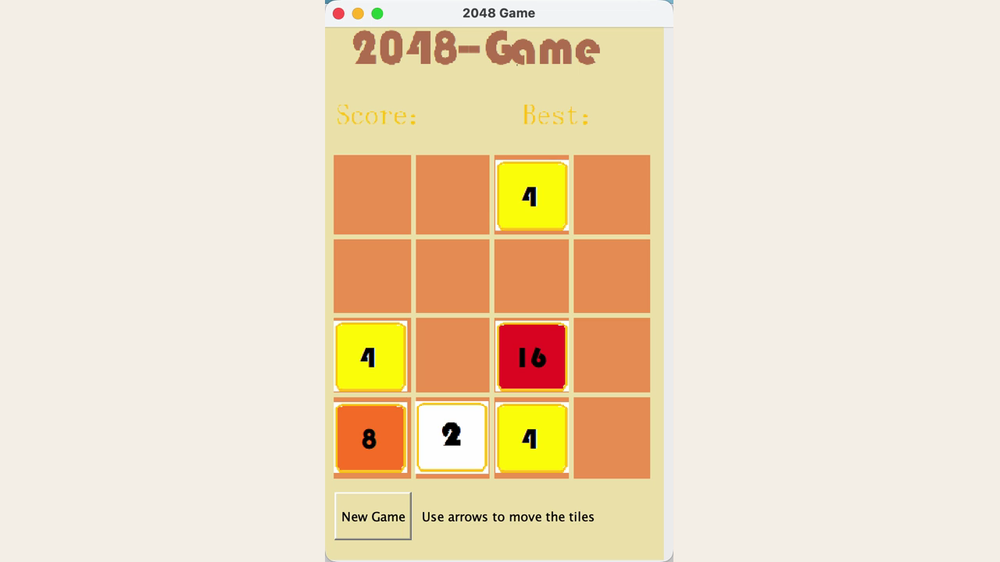

# 2048

一个简洁的 Java Swing 版 2048，重点展示网格移动、数字合并、计分与重新开始。

[English](README.md)

## 项目概述

本项目将经典 2048 规则实现为桌面应用。玩家可使用方向键或 WASD 操作 4×4 棋盘，合并相同数字，并在系统持续生成新方块和检测结束状态的过程中获得更高分数。

## 截图



截图直接来自运行中的 Swing 游戏，展示真实的中盘棋面。

## 功能

- 方向键与 WASD 操作
- 标准的相同数字合并规则
- 实时分数更新
- 新游戏重置
- 游戏结束检测

## 实现方式

Swing 界面维护一个 4×4 方块模型。每次操作会压缩对应行或列、合并符合条件的相邻方块、生成新方块，并刷新棋盘显示。

## 运行

仓库中的 JAR 已在 Java 25 上验证：

```bash
java -jar 2048.jar
```

## 当前限制

- 暂无自动化测试。
- 当前 JAR 目标版本为 Java 25；若需要支持旧版 Java，应从源码重新构建并验证。
